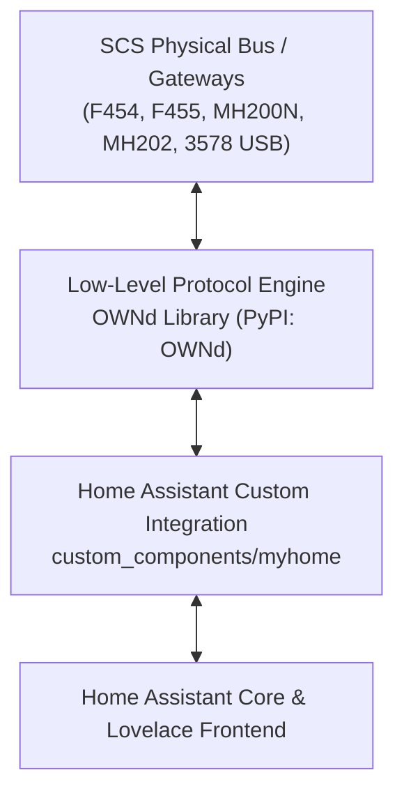
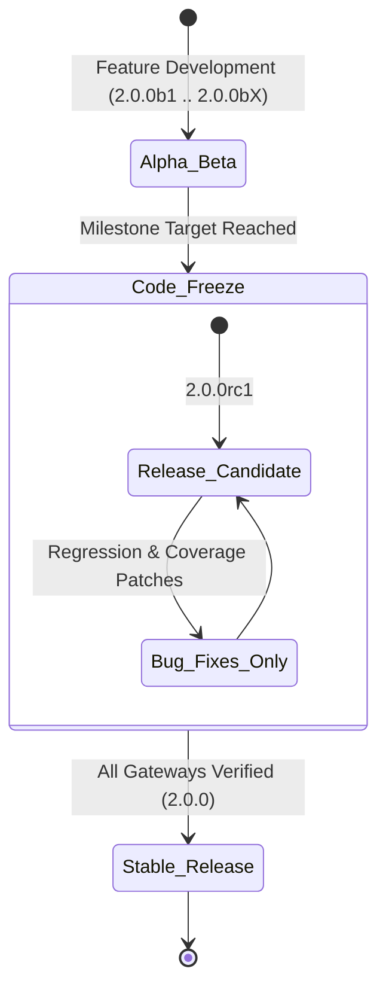

# Contributing to MyHOME for Home Assistant

Thank you for your interest in contributing to **MyHOME for Home Assistant**! 

Our mission is to maintain the most reliable, complete, and high-performance integration between Home Assistant and the BTicino / Legrand SCS OpenWebNet ecosystem. We hold ourselves to uncompromising engineering standards:
- **Zero-latency asynchronous architecture**
- **Hardware-level protocol fidelity**
- **Strict 100% automated test coverage across all component modules**
- **Full compatibility with current and upcoming Home Assistant Core releases**

Please read through this guide before submitting issues or pull requests.

---

## Table of Contents
1. [Architectural Tiering: "OWNd First" Rule](#1-architectural-tiering-ownd-first-rule)
2. [Bug Reports & Triage: "No Bus Trace, No Bug"](#2-bug-reports--triage-no-bus-trace-no-bug)
3. [Branching Strategy & PR-Only Workflow](#3-branching-strategy--pr-only-workflow)
4. [Development & Testing Standards](#4-development--testing-standards)
5. [Release Lifecycle & Code Freeze Rules](#5-release-lifecycle--code-freeze-rules)

---

## 1. Architectural Tiering: "OWNd First" Rule

The MyHOME integration operates on a strict **two-tier architecture**:



### The Boundary
- **`OWNd` (Upstream Protocol Engine):**
  - All low-level OpenWebNet packet parsing, regexes, framing, and command generation.
  - All WHO specifications (e.g., WHO=1 Lighting, WHO=2 Automation/Covers, WHO=4 Thermoregulation, WHO=5 Burglar Alarm, WHO=15/25 Dry Contacts).
  - All dimension decoders, gateway profile definitions (`F454Profile`, `MH200NProfile`, etc.), session concurrency rules, and raw socket/serial transports (`AsyncTcpTransport`, `AsyncSerialTransport`).
- **`custom_components/myhome` (Home Assistant Integration):**
  - Home Assistant platform entities (`light`, `switch`, `cover`, `climate`, `sensor`, `binary_sensor`, `alarm_control_panel`, `button`).
  - Config flows, options flows, reauthentication, and YAML migration handlers.
  - Home Assistant device registry and entity registry bindings.
  - Lovelace frontend card registration (`<myhome-bus-card>`) and WebSocket APIs.

### The Rule
> [!IMPORTANT]
> **Never introduce raw OpenWebNet frame regexes, custom packet parsers, or hardcoded WHO/WHAT decoding logic directly into `custom_components/myhome`.**
> 
> If you are adding support for a new device type, dimension, or gateway model:
> 1. **Submit a PR to [`OWNd`](https://github.com/OpenWebNet-HA/OWNd) first.** Add the packet parser, event/command classes, and unit tests upstream.
> 2. Once the `OWNd` PR is merged and a new version is released on PyPI, bump the requirement in `custom_components/myhome/manifest.json`:
>    ```json
>    "requirements": [
>      "OWNd==<new_version>"
>    ]
>    ```
> 3. Submit your PR to `MyHOME` wiring up the newly supported events and commands to Home Assistant entities.

PRs that violate this separation by parsing raw frame strings directly within platform files will be asked to move that logic upstream to `OWNd`.

---

## 2. Bug Reports & Triage: "No Bus Trace, No Bug"

OpenWebNet gateway hardware and firmware implementations differ significantly across generations (e.g., F454 vs. legacy MH200 scenario programmers vs. Legrand 3578 USB serial interfaces). What works on one gateway can fail on another due to session limits, buffer sizing, or proprietary frame quirks.

Because of this, **we cannot diagnose or triage hardware/protocol issues from descriptions alone**.

> [!CAUTION]
> **Every bug report involving device behavior, command execution, discovery, or communication drops MUST include a raw OpenWebNet bus trace or diagnostic bundle.**
> Reports lacking a bus trace will receive the `needs-trace` label and will be paused until trace data is provided.

### How to Capture a Bus Trace

Choose whichever method is easiest for you:

#### Option A: 1-Click Bus Trace Bundle (Recommended)
If you have the **MyHOME Bus Monitor Card** (`<myhome-bus-card>`) installed in your Lovelace dashboard:
1. Open the card during or immediately after reproducing the bug.
2. Click **"📋 Report Issue / Copy Trace"**.
3. Paste your clipboard directly into the GitHub issue description. It automatically bundles your gateway model, queue telemetry, and recent raw bus frames.

#### Option B: Home Assistant Diagnostics File
1. In Home Assistant, navigate to **Settings ➔ Devices & Services ➔ MyHOME**.
2. Click the **⋮ (three dots)** menu on the gateway entry and choose **Download diagnostics**.
3. Drag & drop the downloaded `myhome-*.json` file directly into the GitHub issue attachment box. Sensitive tokens and passwords are automatically redacted.

#### Option C: Debug Logs with OpenWebNet Frames
Add the following to your `configuration.yaml` and restart Home Assistant:
```yaml
logger:
  default: info
  logs:
    custom_components.myhome: debug
    OWNd: debug
```
Reproduce the issue, download the full log (**Settings ➔ System ➔ Logs ➔ Download full log**), and attach it to your issue report.

---

## 3. Branching Strategy & PR-Only Workflow

To maintain production stability and protect our release pipelines, this repository enforces a **Strict PR-Only Workflow**:

- **No Direct Commits to Main/Master:** Direct pushes to `master`, `main`, or active release branches are blocked by branch protection rules for all contributors and maintainers.
- **Pull Request Required:** All changes—no matter how small—must arrive via a Pull Request opened against `master` (or the targeted milestone branch).
- **Mandatory Passing CI:** A PR cannot be merged unless all required GitHub Actions checks pass:
  - `validate` (HACS schema and Home Assistant validation)
  - `Validate PyPI Packaging Standards` (`build`, `twine check --strict`, `check-wheel-contents`)
  - `test-coverage` (Pytest suite execution and 100% coverage enforcement)
- **Review Approvals:** At least one maintainer review approval is required prior to merge.

### Recommended Git Workflow
1. Fork the repository and clone it locally.
2. Create a feature branch from latest `master`:
   ```bash
   git checkout master
   git pull upstream master
   git checkout -b fix/issue-123-cover-travel-time
   ```
3. Use [Conventional Commits](https://www.conventionalcommits.org/) for your commit messages:
   - `feat: add support for WHO=4 fancoil 3-speed fan modes (#210)`
   - `fix: prevent gateway buffer lockup during burst commands (#215)`
   - `docs: update bus trace diagnostic capture instructions`
   - `test: add unit coverage for Aux channel inverted state`
4. Keep PR branches clean:
   - Rebase against upstream `master` instead of creating merge commits.
   - Do not commit generated build artifacts or local virtual environments (`.venv`).

---

## 4. Development & Testing Standards

### Environment Setup
MyHOME requires **Python 3.12** or **3.11**. We strongly recommend developing inside a dedicated virtual environment:

```bash
# Create virtual environment
python -m venv .venv

# Activate virtual environment
# Windows (PowerShell):
.venv\Scripts\Activate.ps1
# Linux / macOS:
source .venv/bin/activate

# Install development & test dependencies
pip install --upgrade pip
pip install -e ".[test]" homeassistant pytest-socket
```

### Running the Test Suite
Before opening a PR, execute the full test suite locally:

```bash
pytest tests/ --cov=custom_components.myhome --cov-report=term-missing
```

### Strict 100% Test Coverage Enforcement
Our CI pipeline enforces zero-tolerance code coverage through [`scripts/verify_ownd_coverage.py`](file:///c:/Users/laurensvdb/Documents/GitHub/MyHOME/scripts/verify_ownd_coverage.py).

> [!IMPORTANT]
> **Every statement and branch in every module under `custom_components/myhome/` must maintain 100.0% test coverage.**
> 
> If your changes leave even a single line or branch uncovered, CI will fail. You can verify coverage compliance locally with:
> ```bash
> pytest tests/ --cov=custom_components.myhome --cov-report=xml
> python scripts/verify_ownd_coverage.py
> ```

### Snapshot Testing Hygiene
When writing tests that use Syrupy snapshots (e.g. device registry or state snapshots):
- Run tests in verification mode (default `pytest`).
- Only run `pytest --snapshot-update` when you have deliberately altered an entity's attribute structure and manually verified that the diff is intended.
- Never blindly commit updated snapshots without inspecting the diff.

---

## 5. Release Lifecycle & Code Freeze Rules

MyHOME follows [Semantic Versioning](https://semver.org/) and a structured stabilization cycle:



### 1. Alpha & Beta Releases (`vX.Y.ZbN`)
- Active development phase where new platforms, subsystems, and features are introduced.
- Public beta releases are published via HACS to gather real-world bus trace feedback across diverse gateway models.

### 2. Code Freeze & Release Candidates (`vX.Y.ZrcN`)
- When a milestone milestone is scheduled for general release, a **Feature Freeze** is declared.
- **Freeze Rules:**
  - **No new features or platform expansions** may merge into the release branch.
  - Only **critical bug fixes, hardware regression patches, and test coverage improvements** are accepted.
  - Any new feature PRs submitted during freeze will be held for the next minor release milestone.

### 3. Stable General Availability (`vX.Y.Z`)
- Declared once a Release Candidate has completed regression testing across all primary gateway profiles (F454, F455, MH200/202, MyHomeServer1) with zero open critical defects.

---

Thank you for helping make MyHOME rock-solid for everyone in the smart home community!
