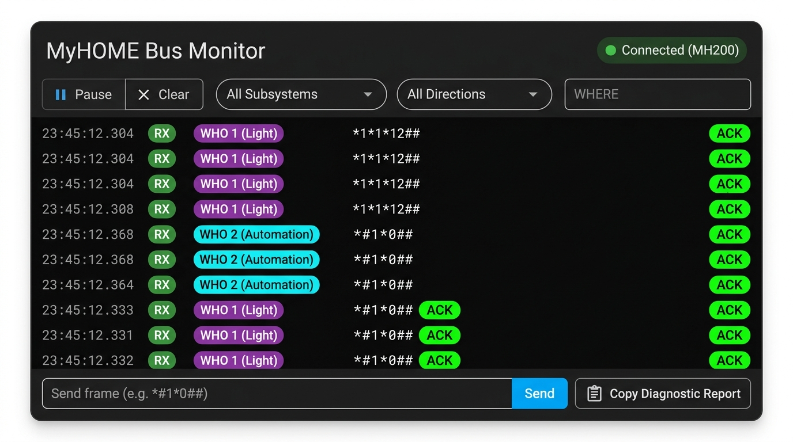

# MyHOME — OpenWebNet Integration for Home Assistant

[](https://github.com/OpenWebNet-HA/MyHOME/actions/workflows/hassfest.yml)
[](https://github.com/OpenWebNet-HA/MyHOME/actions/workflows/validate.yml)
[](https://github.com/OpenWebNet-HA/MyHOME/actions/workflows/test-coverage.yaml)
[](https://app.codecov.io/gh/OpenWebNet-HA/MyHOME/tree/v2-phase1-architecture)
[](https://app.codecov.io/gh/OpenWebNet-HA/MyHOME/tree/v2-phase1-architecture)
[](https://github.com/OpenWebNet-HA/MyHOME/actions/workflows/pypi_standards.yml?query=branch%3Av2-phase1-architecture)
[](https://hacs.xyz)
[](https://github.com/OpenWebNet-HA/MyHOME/releases)
[](https://www.python.org/)
[](https://github.com/astral-sh/ruff)
[](https://github.com/OpenWebNet-HA/MyHOME/wiki/OpenWebNet-Protocol-&-WHO-Specifications)
[](https://github.com/OpenWebNet-HA/MyHOME/discussions)
[](https://www.gnu.org/licenses/gpl-3.0)

Modern, async-native Home Assistant integration for **BTicino / Legrand MyHOME** SCS bus systems connected via OpenWebNet IP gateways.

Maintained by the **[OpenWebNet-HA](https://github.com/OpenWebNet-HA)** community organisation.

[📦 Installation](#-installation) • [🏛️ Supported Hardware](#️-supported-hardware) • [📚 Wiki Docs](https://github.com/OpenWebNet-HA/MyHOME/wiki) • [💬 Discussions](https://github.com/OpenWebNet-HA/MyHOME/discussions) • [🤝 Contributing](CONTRIBUTING.md) • [🔒 Security](SECURITY.md)

> [!TIP]
> **🚀 V2 Phase 1 Architecture Beta Now Live**: The modernized OpenWebNet integration is now available as an official GitHub pre-release (**`2.0.0b2`**)! See the [Installation & Beta Guide](#-installation) below to install or update in 2 minutes.

---

## 🌟 Key Features & Modern V2 Architecture

- **Declarative Hardware Profiles**: Auto-detects and tunes connection limits and queue pacing specifically for your gateway model (`MH200`, `MH200N`, `MH202`, `F454`, `F455`, `AM4890`, `MyHomeServer1`, and `Legrand 3578`). Eliminates hardware session exhaustion and buffer overflows.
- **USB / Serial Gateway & OpenZigBee Support**: Native asynchronous transport for the **Legrand 3578 USB/Serial interface** via `pyserial-asyncio` with dynamic port discovery, authentication bypass, and OpenZigBee addressing (`<8-digit id>#9`).
- **Zero-Friction Migration**: Upgrades preserve all existing custom entity IDs (`light.keuken`, `cover.living`) and friendly names. Unique IDs migrate transparently (`MAC-WHERE` → `MAC-WHO-WHERE`) with no broken dashboards or automations.
- **Adaptive Inter-Frame Bus Pacing**: Hardened priority command queue with model-specific inter-frame delays (e.g. 150ms for legacy MH200 vs 20ms for F454) preventing command dropping during heavy automation bursts.
- **Dynamic Bus Auto-Discovery**: Automatically discovers entities from physical bus events and status sweeps without requiring manual `myhome.yaml` configuration. Full support for **F422 cross-bus routing** (e.g. `18#4#02`).
- **Sound System 2.0 & Audio Matrix (WHO=16)**: Complete multi-room audio support for F441 / F441M matrices and amplifiers, including zone power, volume normalization (0–31 scale), software mute emulation, and dynamic streaming proxy.
- **Streaming Audio Dynamic Proxy**: Seamlessly stream from **Music Assistant**, **Spotify Connect**, or any HA media player to wired BTicino audio zones using a thread-safe `DecoderPool` with analog gain-staging.
- **Dimmable Light Detection**: Auto-detects dimming capabilities directly from bus events with transition support.
- **Comprehensive Test Suite**: Over 935 automated unit tests (100% line coverage) executed across modern Python 3.12+ and Home Assistant core standards.

---

## 📚 Documentation & OpenWebNet Protocol Specifications (Wiki)

We now maintain a comprehensive, community-curated **[GitHub Wiki](https://github.com/OpenWebNet-HA/MyHOME/wiki/OpenWebNet-Protocol-&-WHO-Specifications)** and **[Master Specifications Registry](docs/openwebnet-who-specifications.md)** documenting the OpenWebNet protocol, hardware profiles, and WHO subsystem specifications:

👉 **[OpenWebNet Protocol & WHO Specifications Wiki](https://github.com/OpenWebNet-HA/MyHOME/wiki/OpenWebNet-Protocol-&-WHO-Specifications)**  
👉 **[Official Legrand Developer Portal (PDF Documentation)](https://developer.legrand.com/local-interoperability/#PDF%20documentation)**  
👉 **[Master Document Archive (15 Specifications — PR #232)](https://github.com/user-attachments/files/32008617/OWN.DOC.zip)**

### Key Wiki Resources & Current Status
- **[WHO Specifications Archive & Status Matrix](https://github.com/OpenWebNet-HA/MyHOME/wiki/OpenWebNet-Protocol-&-WHO-Specifications#openwebnet-who-specifications-matrix)**: Complete catalog of all OpenWebNet WHO families (WHO 0 to WHO 1004, HMAC authentication, and core system intro) with official PDF documentation references, current implementation status, and frame syntax.
- **[CEN / CEN+ Automations & Community Blueprint](https://community.home-assistant.io/t/myhome-cen-commands/260345)**: Community blueprint by **gST84** to trigger actions, toggle non-BTicino smart devices, and dim lights from physical MyHOME pushbuttons.
- **[Hardware Gateway Profiles](https://github.com/OpenWebNet-HA/MyHOME/wiki/Gateway-Profiles)**: Deep dive into connection constraints, socket limits, pacing delays, and watchdog behaviors for MH200, MH200N, MH202, F454, F455, MyHomeServer1, and Legrand 3578.
- **[Sound System 2.0 & Audio Matrix Guide](https://github.com/OpenWebNet-HA/MyHOME/wiki/Sound-System-2.0-&-Audio-Matrix)**: Setup instructions for F441/F441M matrices, room amplifier calibration, and Dynamic Proxy streaming.
- **[Bus Monitor Lovelace Card](https://github.com/OpenWebNet-HA/MyHOME/wiki/Bus-Monitor-Lovelace-Card)**: Bus card installation, live frame decoding, diagnostic logging, and syntax injector reference.
- **[Community Contribution Guide](https://github.com/OpenWebNet-HA/MyHOME/wiki/OpenWebNet-Protocol-&-WHO-Specifications#how-to-contribute-specifications)**: How to cross-check documentation versions and contribute missing WHO PDF specifications.

---

## 🏛️ Supported Hardware

### Gateway Profiles

| Gateway Model | Protocol Support | Max Command Workers | Inter-Frame Delay | UPnP Discovery | Notes |
|---|---|---|---|---|---|
| **F454** | OpenWebNet / HMAC | 4 workers | 20 ms | ✅ Port 49153 | Full high-speed multi-session support |
| **F455** | OpenWebNet / HMAC | 4 workers | 20 ms | ✅ Port 49153 | Dual-bus capable |
| **MH202** | OpenWebNet / HMAC | 3 workers | 30 ms | ✅ Port 49153 | Modern scenario programmer gateway |
| **MyHomeServer1** | OpenWebNet / HMAC | 4 workers | 20 ms | ✅ SSDP | Cloud/local hybrid gateway |
| **MH200N** | OpenWebNet | 2 workers | 80 ms | ❌ Manual | Second-generation scenario programmer |
| **MH200** *(Legacy)* | OpenWebNet | 1 worker | 150 ms | ❌ Manual | Strict single-session pacing; watchdog hardened |
| **AM4890** | OpenWebNet | 2 workers | 100 ms | ❌ Manual | Compact residential gateway |
| **Legrand 3578** | OpenWebNet (Serial) | 2 workers | 50 ms | ❌ Manual (Serial) | USB / Serial gateway & OpenZigBee interface |

### Supported Entity Domains

| Domain | WHO | Capabilities |
|---|---|---|
| **`light`** | WHO=1 | On/Off, Dimmers with brightness control & transitions |
| **`switch`** | WHO=1 | Relays, auxiliary switches, socket actuators |
| **`cover`** | WHO=2 | Motorized shutters, blinds, roll-ups with state tracking |
| **`climate`** | WHO=4 | Heating, cooling, 4-pipe systems, thermostats, setpoints |
| **`binary_sensor`**| WHO=25 | Magnetic contacts, door/window sensors, PIR motion |
| **`sensor`** | WHO=18 | Power meters, energy counters, voltage, pulse monitors |
| **`button`** | WHO=1 / 25 | Scenario buttons, lock/unlock triggers, bus ping |
| **`media_player`** | WHO=16 | F441/F441M audio zones, source tracking, volume, mute |

---

## 📦 Installation & Updating

### Method 1: HACS (Recommended)

#### Step 1: Add the Organization Repository
1. Open **HACS** in your Home Assistant UI.
2. Click the **three dots (`⋮`)** in the top-right corner and select **Custom repositories**.
3. Add the repository details:
   - **Repository:** `https://github.com/OpenWebNet-HA/MyHOME`
   - **Type / Category:** `Integration`
4. Click **Add**.

> [!CAUTION]
> **Migrating from a personal fork? DO NOT delete the MyHOME integration from Home Assistant Settings!**
> Deleting the integration from *Settings → Devices & Services* will wipe all configured gateways and devices.
> If you previously tracked a personal fork (such as `GreenGrassBlueOcean/MyHOME`):
> 1. Open **HACS → ⋮ → Custom repositories**.
> 2. Click the **red trash can icon** next to the old fork URL to unlink it.
> 3. Verify `OpenWebNet-HA/MyHOME` is added.
> 4. All your configured devices, gateways, and automations remain 100% intact.

#### Step 2: Enable Beta Releases & Download

- **In HACS 2.0+ (via Entity Switch):**
  1. In Home Assistant, navigate to **Settings → Devices & Services**.
  2. Click on the **HACS** integration tile → **Entities**.
  3. Locate the pre-release switch for MyHome: **`MyHome (Approve pre-releases)`** or **`MyHome Beta`** (enable the entity first if disabled).
  4. Turn that switch **ON**.
  5. Open **HACS → Integrations → MyHome**.
  6. Click the blue **Download** button (or `⋮` → **Redownload**), select **`2.0.0b2`** from the version dropdown, and click **Download**.

- **In HACS 1.x:**
  1. Open **HACS → Integrations → MyHome**.
  2. Click the **three dots (`⋮`)** in the top-right corner and select **Redownload** (or click **Download**).
  3. Toggle **"Show beta versions"** to **ON**.
  4. Select **`2.0.0b2`** from the version dropdown and click **Download**.

#### Step 3: Restart Home Assistant
Go to **Settings → System → Restart** (or **Developer Tools → YAML → Restart**).

---

### Method 2: One-Liner via Terminal & SSH Add-on (Fastest & 100% Direct)

If you have the **Terminal & SSH** add-on enabled in Home Assistant, run this command to install or update directly without navigating HACS:

```bash
cd /config/custom_components
wget https://github.com/OpenWebNet-HA/MyHOME/releases/download/2.0.0b2/myhome.zip -O myhome_beta.zip
rm -rf myhome
unzip -q myhome_beta.zip -d myhome
rm myhome_beta.zip
```
Then restart Home Assistant:
```bash
ha core restart
```

> [!NOTE]
> All existing entity names, custom entity IDs, and gateway configurations are preserved automatically.

---

### Method 3: Manual Installation (Archive / Samba)

1. Download the latest release package:  
   👉 **[Download myhome.zip (v2.0.0b2)](https://github.com/OpenWebNet-HA/MyHOME/releases/download/2.0.0b2/myhome.zip)**
2. Open your Home Assistant configuration directory (via **Samba Share**, **Studio Code Server**, or **File Editor** add-on).
3. Extract `myhome.zip` directly into `/config/custom_components/myhome/` (overwriting the existing files).
4. Restart Home Assistant (**Settings → System → Restart**).

---

### 🔄 Safe Rollback

If you ever need to revert to the legacy codebase (`0.9.4`):
- **Via HACS:** Open **MyHome** → click `⋮` → **Redownload** → select **`0.9.4`** → **Download** → Restart Home Assistant.
- **Via Terminal & SSH:**
  ```bash
  cd /config/custom_components
  wget https://github.com/OpenWebNet-HA/MyHOME/releases/download/0.9.4/myhome.zip -O myhome_legacy.zip
  rm -rf myhome
  unzip -q myhome_legacy.zip -d myhome
  rm myhome_legacy.zip
  ha core restart
  ```

---

## ⚙️ Configuration

### Adding the Gateway

1. Navigate to **Settings → Devices & Services → Add Integration**.
2. Search for **MyHOME**.
3. Choose your gateway type:
   - **Network Gateway (TCP/IP)**:
     - **Auto-Discovery**: The integration automatically discovers UPnP/SSDP-compatible gateways on your local subnet (e.g. F454, MH202, MyHomeServer1). Discovered gateways appear in the Home Assistant UI with standard **Configure** and **Ignore** options, requiring explicit user confirmation before any config entry is created.
     - **Manual IP Setup**: For gateways without UPnP (e.g. MH200), enter the gateway IP address, port (default `20000`), MAC address, and OpenWebNet password (default `12345`).
   - **USB / Serial Gateway (Legrand 3578 / OpenZigBee)**:
     - Select your physical serial device (e.g. `/dev/ttyUSB0` or `COM3`) from the dynamically populated port picker.
     - Select your baud rate (default `19200`).
     - Serial transport operates with zero authentication overhead (no IP password challenge needed) and natively routes OpenZigBee addresses (`<8-digit id>#9`).
4. Select or confirm your gateway hardware profile from the dropdown.

### Options Flow (Fine-Tuning)

Go to **Settings → Devices & Services → MyHOME → Configure** to customize:
- **Scan Interval**: Frequency of background state sync sweeps.
- **Command Queue Delay**: Override inter-frame delay if your gateway experiences packet loss.
- **Audio Decoders Pool**: Map network media players to physical matrix source inputs (see below).

---

## 🎵 Multi-Room Audio & Dynamic Proxy

The BTicino sound system matrix (F441 / F441M) is an analog matrix switch. It routes physical source inputs (IN 1–4) to amplified room zones.

This integration includes a **Dynamic Proxy** that lets you stream IP audio (via Music Assistant, Spotify Connect, AirPlay, etc.) directly to your wired BTicino zones.

### Hardware Routing Architecture

```
┌────────────────────────┐      ┌─────────────────────────┐      ┌─────────────────────────┐
│     Media Source       │      │       DecoderPool       │      │      F441M Matrix       │
│  (Music Assistant /    │─────▶│  - claims idle decoder  │─────▶│   (Hardware Routing)    │
│   Spotify Connect)     │      │  - gain staging (clean) │      │                         │
│                        │      │  - activates zone (O/I) │      │   IN 1 ────▶ Living     │
└────────────────────────┘      └─────────────────────────┘      │   IN 2 ────▶ Kitchen    │
                                             ▲                   │   IN 3 ────▶ Bedroom    │
                                             │                   └─────────────────────────┘
                                  ┌──────────┴──────────┐                     ▲
                                  │   Network Decoders   │                     │
                                  │                      │                     │
                                  │  Decoder 1 (Wiim)    │────── RCA ──────────┘ (IN 1)
                                  │  Decoder 2 (HiFiDAC) │────── RCA ──────────┘ (IN 2)
                                  └──────────────────────┘
```

### Setting Up Streaming

1. Wire your network streamer (e.g. Raspberry Pi running squeezelite, WiiM, Cambridge Audio) to one of the matrix inputs (e.g. Source 1 or 2).
2. In Home Assistant, ensure the streamer is available as a `media_player` entity.
3. Open **MyHOME Options** (`Configure`), navigate to **Decoders**, and specify:
   - **Entity**: The streamer's `media_player` entity ID.
   - **Source**: The physical matrix input number (1–4) it is plugged into.
   - **Pre-Gain**: Analog offset percentage (recommended `15–20%` for line-level DACs, `0%` for fixed pre-amps).
4. Send audio from Music Assistant or Spotify to your BTicino zone entity:
   - The proxy automatically claims the decoder, wakes it, applies gain staging, and activates the zone.
   - When playback stops, the decoder is released back to the pool.

---

## 📡 Real-Time Bus Monitor & Diagnostics

The integration includes an in-band real-time bus monitor operating over the existing gateway event stream with zero extra socket connections:

### Lovelace Bus Monitor Card (`<myhome-openwebnet-bus-monitor>`)

<p align="center">
  
</p>

A modern custom Lovelace element is automatically registered with zero configuration:

- **Visual Card Picker & GUI Editor**: Fully integrated with Home Assistant's card picker — simply search for **"MyHOME OpenWebNet Bus Monitor"** (or search **"MyHOME"** / **"OpenWebNet"**) under `+ Add Card` and configure the title or buffer size visually without touching raw YAML (YAML type `custom:myhome-openwebnet-bus-monitor`, with `custom:myhome-bus-card` supported as a backward-compatible alias).
- **Live Bus Stream**: High-performance scrolling feed with color-coded badges for subsystems (Lighting `WHO=1`, Automation `WHO=2`, Climate `WHO=4`, Sound `WHO=16`, Energy `WHO=18`, CEN `WHO=15/25`) and ACK (`*#*1##`) / NACK (`*#*0##`) highlighting.
- **Interactive Controls**: Live Pause/Resume, buffer clearing, and instant filtering by subsystem, WHERE address, and Direction (RX/TX).
- **Manual Frame Injector**: Send raw OpenWebNet diagnostic frames directly to the bus with syntax validation.
- **One-Click Diagnostic Bug Reporter**: Click **"📋 Copy Diagnostic Report"** to copy a sanitized, GitHub-ready Markdown bundle containing:
  - Home Assistant Core & integration versions
  - Hardware gateway profile, firmware, connection type, queue pacing, and worker counts
  - Live buffer depth and RX/TX counters
  - Collapsible OpenWebNet bus trace (`<details><summary>OpenWebNet Bus Trace</summary>`)
  - Direct link opening pre-filled GitHub Issue Forms!

> [!TIP]
> **Troubleshooting: Card not showing up or "Custom element doesn't exist"?**
> 
> 1. **Manual Resource Verification**: While the integration automatically registers the card resource, you can verify or manually add it under **Settings ➔ Dashboards ➔ Resources** (click the three dots ⋮ in the top-right corner):
>    - **URL:** `/myhome_static/myhome-bus-card.js`
>    - **Resource Type:** `JavaScript Module`
> 2. **Check for Conflicting HACS Cards**: If custom cards fail to load or the card picker spins indefinitely, inspect your browser console (`F12`). A common cause is conflicting or duplicate custom cards (e.g. having both `scheduler-card` and `lovelace-standalone-schedule-card` installed simultaneously). An uncaught `CustomElementRegistry` collision in an earlier card halts the browser's Lovelace resource-loading pipeline before subsequent cards can initialize. Removing the duplicate card resolves the blockage immediately.
> 3. **Hard Browser Refresh**: After adding resources or updating components, perform a hard refresh (`Ctrl + F5` or `Ctrl + Shift + R`) to ensure the browser loads the latest JavaScript bundle from the gateway.

### 📝 Structured GitHub Issue Forms

When reporting issues or requesting new device support on GitHub, interactive forms ensure complete diagnostics:
- **Bug Report**: Gateway profile dropdown, connection type, HA version, diagnostics JSON attachment, and pre-formatted bus trace.
- **Device Support Request**: Structured form for adding new BTicino/Legrand modular components with WHO codes and frame samples.

---

## 🛠️ Development & Quality Standards

This project enforces strict code quality and packaging standards:

```bash
# Run the complete test suite
pytest tests/

# Run with coverage report
pytest --cov=custom_components.myhome --cov-report=term-missing tests/

# Validate PyPI packaging and PEP 517 compliance
python -m build
twine check --strict dist/*
check-wheel-contents dist/*.whl
```

See the [F454 regression checks](docs/f454-regression-checks.md) for the fixes,
automated coverage and physical gateway verification steps.

### CI Workflows
- **`hassfest`**: Official Home Assistant manifest, translation, and metadata validation.
- **`validate`**: Official HACS compliance checks.
- **`test-coverage`**: 935 automated unit tests with snapshot matching and 100% line coverage enforcement on the `ownd` core package.
- **`ha_standards`**: Automated architectural standards enforcement (`verify_ha_standards.py` / `test_ha_standards.py`) ensuring user-confirmed discovery flows, complete step translations, no deprecated constants, and no blocking calls in async coroutines.
- **`ha-upstream-compat`**: Continuous integration testing against upstream Home Assistant Stable, Beta, and Dev channels.
- **`pypi_standards`**: Strict wheel hygiene, metadata verification, and packaging checks.

### 📊 Code Coverage & Quality Assurance

The integration maintains 935 automated unit tests (100% line coverage across all modules) covering core protocol handling, hardware profiles, discovery, state reconciliation, and error boundaries.

<!-- START_COVERAGE_TABLE -->

| Component / Module | Coverage | Notes |
|---|:---:|---|
| [`__init__.py`](custom_components/myhome/__init__.py) | **100%** | Setup lifecycle and zero-friction entity migration |
| [`alarm_control_panel.py`](custom_components/myhome/alarm_control_panel.py) | **100%** | Core integration component |
| [`binary_sensor.py`](custom_components/myhome/binary_sensor.py) | **100%** | Magnetic contacts, door/window sensors, motion sensors |
| [`bus_monitor.py`](custom_components/myhome/bus_monitor.py) | **100%** | In-band 500-frame circular ring buffer tap (0 extra sockets) |
| [`button.py`](custom_components/myhome/button.py) | **100%** | Scenario buttons and bus diagnostic pings |
| [`climate.py`](custom_components/myhome/climate.py) | **100%** | Heating, cooling, 4-pipe systems, and thermostat controls |
| [`config_flow.py`](custom_components/myhome/config_flow.py) | **100%** | Step handlers, user entry, reauth, and options flow |
| [`const.py`](custom_components/myhome/const.py) | **100%** | Protocol commands, dimensions, and integration constants |
| [`core/transport/base.py`](custom_components/myhome/core/transport/base.py) | **100%** | Abstract transport layer defining OWN lifecycle contract |
| [`core/transport/serial.py`](custom_components/myhome/core/transport/serial.py) | **100%** | Async Serial/USB transport for Legrand 3578 / OpenZigBee |
| [`core/transport/tcp.py`](custom_components/myhome/core/transport/tcp.py) | **100%** | Modular TCP/IP socket transport with framed stream parsing |
| [`cover.py`](custom_components/myhome/cover.py) | **100%** | Motorized shutters, blinds, roll-ups with state tracking |
| [`decoder_pool.py`](custom_components/myhome/decoder_pool.py) | **100%** | Thread-safe streaming proxy audio pool |
| [`device_trigger.py`](custom_components/myhome/device_trigger.py) | **100%** | Stateless CEN/CEN+ scenario device automation triggers |
| [`diagnostics.py`](custom_components/myhome/diagnostics.py) | **100%** | Config entry diagnostics with sensitive data redaction |
| [`gateway.py`](custom_components/myhome/gateway.py) | **100%** | Hardware handler, lockout prevention, adaptive queue pacing |
| [`light.py`](custom_components/myhome/light.py) | **100%** | Relays, auto-dimmer detection, and brightness transitions |
| [`media_player.py`](custom_components/myhome/media_player.py) | **100%** | F441/F441M sound system zones, dynamic proxy, gain-staging |
| [`myhome_device.py`](custom_components/myhome/myhome_device.py) | **100%** | Home Assistant device registry schema compliance |
| [`sensor.py`](custom_components/myhome/sensor.py) | **100%** | Power meters, energy counters, and pulse sensors |
| [`switch.py`](custom_components/myhome/switch.py) | **100%** | Relay actuators, auxiliary switches, socket controllers |
| [`validate.py`](custom_components/myhome/validate.py) | **100%** | Device & gateway schemas, custom WHERE validators, sensor injections |
| [`websocket.py`](custom_components/myhome/websocket.py) | **100%** | WebSocket API for real-time bus streaming, history, and diagnostics |

<!-- END_COVERAGE_TABLE -->

> **Live Test Execution**: View the live code coverage dashboard directly on [**Codecov (v2-phase1-architecture)**](https://app.codecov.io/gh/OpenWebNet-HA/MyHOME/tree/v2-phase1-architecture) or download the interactive HTML report from the [**test-coverage GitHub Actions run**](https://github.com/OpenWebNet-HA/MyHOME/actions/workflows/test-coverage.yaml).

---

## 🗺️ Roadmap

The development of the MyHOME integration is organized into five strategic release milestones. For comprehensive milestone details, technical specifications, and contributor attribution, refer to the full [**ROADMAP.md**](ROADMAP.md).

- [x] **Phase 1: Architecture Modernization & Core Feature Parity (v2.0 — Current)**
  - [x] Declarative hardware gateway profiles (`MH200` to `F454`).
  - [x] Dual asynchronous transports: Async TCP & Serial/USB (`Legrand 3578 / OpenZigBee`).
  - [x] Adaptive inter-frame bus pacing & sentinel supervisor lifecycle.
  - [x] In-band Lovelace Bus Monitor Card (`<myhome-openwebnet-bus-monitor>`) & WebSocket streaming proxy.
  - [x] Native Home Assistant Diagnostics (`diagnostics.py`) & GitHub Issue Forms.
  - [x] Full feature parity across primary subsystems: Light, Switch, Cover, Climate (Fancoil), Alarm, Binary Sensor (3477 Dry Contact / IR), Device Triggers (CEN/CEN+).
  - [x] 100% automated test coverage across all component modules.
- [ ] **Phase 2: Native Bus Timers & Environmental Auto-Discovery (v2.1 — Q4 2026)**
  - [ ] Native SCS light actuator temporization / staircase timers (`WHO = 1` Dimension 2 & timed WHAT codes).
  - [ ] Dynamic discovery for illuminance & motion detectors (Legrand 048834).
  - [ ] Passive bus sniffing & topology auto-mapping.
- [ ] **Phase 3: Actuator Diagnostics & Endpoint Safety Locks (v2.2 — Q4 2026)**
  - [ ] Actuator hardware maintenance locks / endpoint disable (`WHO = 14`).
  - [ ] Relay health telemetry, operating cycle counters, and diagnostic failure codes.
- [ ] **Phase 4: Extended Lighting, Tunable White & DALI-2 (v2.3 — Q1 2027)**
  - [ ] Tunable white (Kelvin/mireds) and RGB/RGBW color control for DALI via F429/F429G.
  - [ ] Native support for Lighting Management Room Controllers (`WHO = 24` BMNE500 / 002645).
- [ ] **Phase 5: Smart Energy Management & Advanced Sound Diffusion (v2.4 — Q1 2027)**
  - [ ] Energy management central units & multi-function power meters (`WHO = 18` F520/F521/F522/F523/3522).
  - [ ] Multi-room sound diffusion source navigation, FM tuner presets, and RDS metadata streaming (`WHO = 22`).

---

## 👥 Credits & Attribution

This integration is developed and maintained by the **[OpenWebNet-HA](https://github.com/OpenWebNet-HA)** community.

Special thanks to:
- **[@anotherjulien](https://github.com/anotherjulien)** for creating the original MyHOME integration and laying the protocol foundations.
- **[@GreenGrassBlueOcean](https://github.com/GreenGrassBlueOcean)** for the v2 modernized architecture, gateway profiles, streaming proxy, and test suite.
- **[@GianlucaCh](https://github.com/GianlucaCh)** for preserving and contributing the comprehensive 15-manual BTicino/Legrand specification archive (`OWN DOC.zip`), the official `WHO_24.pdf` Lighting Management specification, and CEN+ community automation references.
- **[@mantovanellimatteo](https://github.com/mantovanellimatteo)**, **[@fedem95](https://github.com/fedem95)**, **[@lyubomirtraykov](https://github.com/lyubomirtraykov)**, **[@Interstellar0verdrive](https://github.com/Interstellar0verdrive)**, and **Cedric Rohou** for key bugfixes, platform extensions, and community testing.
